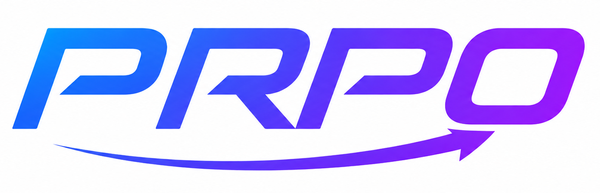

<p align="center">
  
</p>

# PRPO: Paragraph-level Policy Optimization for Vision-Language Deepfake Detection


This repository contains the implementation of PRPO ([Paragraph-level Relative Policy Optimization](https://arxiv.org/abs/2509.26272)), a test-time reinforcement learning algorithm that aligns MLLM reasoning with image content at the paragraph level.

## Overview

PRPO extends traditional reinforcement learning from human feedback (RLHF) by incorporating test-time optimization strategies. The framework uses precomputed embeddings for efficient training and implements advanced reward mechanisms including CLIP similarity scores and consistency rewards for enhanced model performance.

## Prerequisites

- CUDA-capable GPU (recommended: 8x H200 143GB)
- Python 3.10+
- Conda/Miniconda
- Ray for distributed computing
- VLLM for efficient inference

## Setup

### 1. Environment Setup

Create and activate the conda environment using the provided configuration:

```bash
conda env create -f prpo.yaml
conda activate prpo
```

### 2. Data and Model Preparation

Before training PRPO, you need to prepare both the data and model components. This involves two main steps:

#### Step 1: Extract LLaMA Model from DX-LLaVA

Extract the LLaMA backbone from your trained DX-LLaVA model:

```bash
# Extract LLaMA weights with default paths
./prepare/run_extract_llama.sh

# Or with custom paths
./prepare/run_extract_llama.sh \
    --llava-model /path/to/dx-llava-model \
    --output /path/to/extracted-llama
```

**What this script does:**
- Extracts the LLaMA/Vicuna backbone weights from the DX-LLaVA model
- Creates a standalone LLaMA model with proper configuration
- Copies tokenizer files and creates generation config
- Validates the extracted model structure
- Outputs a ready-to-use LLaMA model for PRPO training

#### Step 2: Generate Embeddings and Parquet Data

Convert your JSON training data to parquet format with precomputed embeddings:

```bash
# Complete pipeline (embeddings + parquet conversion)
./prepare/run_embeddings_pipeline.sh \
    --step all \
    --model-path /path/to/dx-llava-model \
    --data-path /path/to/train.json \
    --image-folder /path/to/images \
    --output-dir /path/to/output \
    --domain ddim
```

**What this script does:**
- **Precompute Step**: Loads the DX-LLaVA model and processes images/text to generate embeddings
- **Parquet Step**: Converts embeddings and metadata to efficient parquet format
- Handles batch processing for memory efficiency
- Validates data integrity throughout the process
- Creates the final data structure required for PRPO training

#### Final Data Structure

After running both preparation scripts, you should have:

```
data/
├── ddim/
│   ├── train.parquet           # Training data with embeddings
│   ├── test.parquet            # Test data with embeddings
│   └── dataset_info.json       # Dataset metadata
├── pixart/
└── StyleGAN3/

checkpoints/
├── llama-extracted-from-dx-llava-ddim/    # Extracted LLaMA model
│   ├── config.json
│   ├── model.safetensors
│   ├── tokenizer.model
│   └── generation_config.json
└── dx-llava-binary-ddim/                  # Original DX-LLaVA model
```

#### Parquet File Contents

The generated parquet files contain:
- `inputs_embeds`: Serialized tensor embeddings from DX-LLaVA
- `attention_mask`: Attention masks for embeddings
- `prompt`: Text prompts for the model
- `label`: Ground truth labels (real/fake)
- `image_path`: Original image file paths
- `metadata`: Additional sample information

### 3. Model Checkpoints

After preparation, you'll have:
- **Extracted LLaMA Model**: Clean LLaMA backbone for PRPO training
- **DX-LLaVA Model**: Original multimodal model (for reference)
- **Vision Encoder Weights**: Integrated within the models

## Training

### Quick Start

Execute the PRPO training script:

```bash
./run_train_prpo.sh
```

### Training Process

The training script performs the following steps:

1. **Environment Configuration**: Sets up CUDA, Ray, and VLLM environments
2. **Data Loading**: Loads precomputed embeddings from parquet files
3. **Policy Initialization**: Initializes actor, critic, and reference models
4. **PRPO Training Loop**:
   - **Rollout Generation**: Generates responses using functional embeddings
   - **Reward Computation**: Calculates CLIP similarity and consistency rewards
   - **Policy Update**: Updates actor policy using PRPO objectives
   - **Critic Training**: Trains value function for advantage estimation
5. **Checkpoint Saving**: Saves model states and training metrics

### Configuration

Key training parameters in `run_train_prpo.sh`:

```bash
# Domain and data configuration
DOMAIN="ddim"  # Choose from: ddim, pixart, StyleGAN3, SiT
TRAIN_FILES="data/${DOMAIN}/train.parquet"
VAL_FILES="data/${DOMAIN}/test.parquet"

# Model paths
LLAMA_MODEL_PATH="/path/to/dx_llava/model"
OUTPUT_DIR="../checkpoints/dx_llava_prpo_${DOMAIN}"

# Training hyperparameters
TOTAL_EPOCHS=2
MAX_SAMPLES_PER_EPOCH=1000
BATCH_SIZE=32
MICRO_BATCH_SIZE=1

# PRPO-specific parameters
PRPO_CLIP_EPS=0.2
PRPO_KL_COEF=0.01
ALPHA_CLIP=0.5  # Weight for CLIP reward
BETA_CONSISTENCY=0.5  # Weight for consistency reward
```

### Advanced Configuration

For multi-node training or custom settings:

```bash
# Multi-GPU training with custom batch size
export CUDA_VISIBLE_DEVICES=0,1,2,3,4,5,6,7
BATCH_SIZE=64 MICRO_BATCH_SIZE=2 ./run_train_prpo.sh

# Custom reward weights
ALPHA_CLIP=0.7 BETA_CONSISTENCY=0.3 ./run_train_prpo.sh
```

## Evaluation

### Quick Start

Evaluate your PRPO-trained model:

```bash
./run_eval_prpo.sh
```

### Evaluation Process

The evaluation script includes:

1. **FSDP to HuggingFace Conversion**: Converts FSDP checkpoints to standard format
2. **Multi-GPU Inference**: Distributes evaluation across available GPUs
3. **Performance Metrics**: Computes accuracy, reward scores, and consistency metrics
4. **Response Analysis**: Analyzes generated responses for quality assessment

### Configuration

Modify evaluation parameters in `run_eval_prpo.sh`:

```bash
# Checkpoint and data configuration
DOMAIN="ddim"
CHECKPOINT_DIR="../checkpoints/dx_llava_prpo_${DOMAIN}"
FSDP_CHECKPOINT_PATH="${CHECKPOINT_DIR}/global_step_93/actor"
TEST_FILE="../data/${DOMAIN}/test.parquet"

# Evaluation settings
SAMPLE_SIZE=-1  # Use all samples
PRINT_RESPONSES=true
```

### Memory Optimization

For limited GPU memory:

```bash
# Reduce batch sizes
export MICRO_BATCH_SIZE=1
export BATCH_SIZE=16

# Enable memory optimizations
export VLLM_DISABLE_COMPILATION=1
export PYTORCH_CUDA_ALLOC_CONF=max_split_size_mb:512
```

## Citation

If you use PRPO in your research, please cite:

```bibtex
@inproceedings{tuan2026prpo,
title={{PRPO}: Paragraph-level Policy Optimization for Vision-Language Deepfake Detection},
author={Tuan Nguyen and Naseem Khan and Khang Tran and NhatHai Phan and Issa Khalil},
booktitle={Forty-third International Conference on Machine Learning},
year={2026},
url={https://openreview.net/forum?id=BGcw0KWStP}
}
```

## License

This project is licensed under the Apache License 2.0 - see the LICENSE file for details.

## Acknowledgments

- [TTRL](https://github.com/PRIME-RL/TTRL) framework for test-time reinforcement learning
- VERL framework for distributed RL training
- Ray and VLLM for efficient distributed computing
- OpenAI CLIP for vision-language alignment